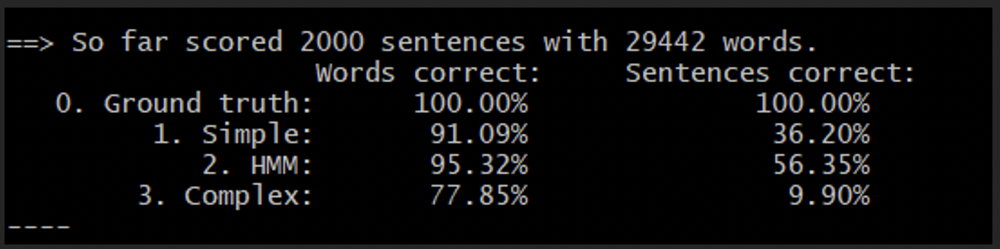
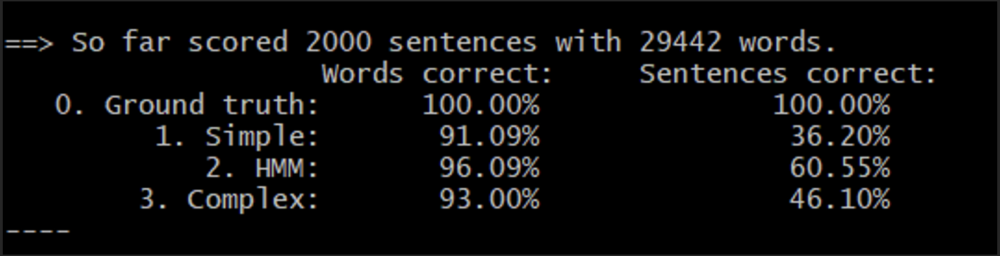

# a3-release
## mranka-tmahind-skakatka

### Question 1:
In a nutshell we are using HMM to guess the part of speech of the word.
#### Description of how I formulated the problem:
#### States – 
Each observed state is a word, and each hidden state is a part of speech of the word. We calculate the initial probabilities for the part of speech, the transition probabilities from one part of speech to the next and the emission probabilities from the part of speech to the word.
I have used dictionaries to store the probabilities as they have constant fetching time.
##### Initial probability of pos is calculated by,
the_particular_grammar_word_count/total_grammar_words_count
##### Transition probabilities for the hidden state is calculated by,
P(q[t]|q[t-1]) = total number of times q[t] and q[t-1] has occurred/total number of times state q[t-1] has occurred where q[t-1] is the part of speech occurred at time q[t-1] and q[t] is the part of speech occurring at time t.
##### Emission probabilities is given by, 
the P(word_observed|pos) this is calculated by total_count_of_word_and_pos_occuring/total_pos_word
#### Brief description of how the program works:
The program is run using the python command and we are passing a parameters the bc.train file and the bc.test file. Using the train file we calculate the initial probabilities, the emission probabilities and the transition probabilities. This is the training part.
We then use the simplified, the hmm and the complex model as given in the images in the problem set to calculate the most probable pos for any given word.
#### Discussion of any problems you faced, any assumptions, simplifications, and/ or design decisions you made:
1.	The most challenging part is that each word can have multiple pos depending on the context. If the word has not occurred in the train data, then guessing the pos for the test data is challenging. For such cases I have written a function grammar_rules which returns the probability of a word ending “ing”, “ed” or “ify” if the tag is verb. This is done for verb, adj, noun and adverb pos as these pos have a few recurring ending characters. For other pos I assign a probability of 0.00000001 if the word is not observed in the train data.
2.	I have used log probabilities because in multiplying numbers ranging from 0 to 1 the numbers are getting very small. As a result, comparing the probabilities to get the max pos gets a little harder as we are comparing values close to zero. To combat this, I have taken log of probabilities which leads to comparison of numbers not close to 0 so that we can find the max probabilities of pos given the word.

#### Results:
Before using the grammar rules function the accuracy summary is

After using the grammar rules function the accuracy summary is

As observed, the improvement of the accuracy after the use of grammar function is significant as we are incorporating the words and the corresponding grammar knowledge.

There is a significant improvement in the accuracy of complex model and HMM model because we have incorporated the knowledge associated with the grammar and the models are connected such that we are considering the pos of previous words. Hence this jump in accuracy for the complex model and HMM model is expected.

As observed the word and sentence accuracy for HMM is the highest followed by the complex model followed by the simplified model.
The complex model performs worse than the HMM model even though the complex model takes a lot of dependencies into account. 

### Question 2:
In a nutshell the problem is to do OCR using HMM.
#### Description of how I formulated the problem
#### States – 
Each state is a character. In the HMM model the observed state is the pixel of characters observed (this data we get from the image) and the hidden state is the character which is most likely to occur given the character observed. This is useful as errors can be made in observing data and we use the hidden states to give the most probable character given the faulty data observed.
In this problem we need to calculate the transition probability, emission probability and the initial state distributions of the characters to train the model.
I have used dictionaries to store the probabilities as they have constant fetching time.
We use the dataset bc.train given in the first question to calculate the transition probability from one character to the next character(this is stored in variable transition_probability). The transition probability for the hidden states is given by P(q[t]|q[t-1]) = total number of time q[t] and q[t-1] has occurred/total number of times state q[t-1] has occurred.
We also use bc.train file to calculate the initial state distributions of the characters(this is stored in variable initial_probability). The initial probability is calculated by number of times a character is the first character of the word/total number of words.
The emission probability is given by P (all_observed_pixels|letter = ‘A’) = P(pixel_1|letter=’A’)*P(pixel_2|letter=’A’)…..*P(pixel_n|letter=’A’)  this value is calculated for all the characters given in the variable TRAIN_LETTERS in the code. (This is stored in the variable emission_probability in the code).
So the emission probability is essentially given by (1-m) ^(number of matched pixels)*(m)^(number of mismatched pixels) where m is the noise parameter. The matched and mismatched pixels are counted with respect to the test image and the train image. The train image is essentially the pixel format of the characters where we are trying to predict that is character in the test image ‘A’, ‘B’ and so on.
#### Brief description of how the program works
The program is initially run using the python command and we are passing as parameters the bc.train file the train image and the test image.
The program initially finds the initial state distributions, emission probabilities and transition probabilities. We initially called the train function to find the distributions that is the initial character distribution, emission probabilities and transition probabilities.
We then find the most probable character given the pixels in the test dataset using the simplified model and using HMM Viterbi algorithm.
#### Simplified model -> 
The simplified model gets the character with the max probability that is for all characters in TRAIN_LETTERS we have calculated P(possible_character|observed_character) (which is essentially the emission probability)
Q_t = argmax P (Q_t = q_t|O_t) over all q_t’s.
#### HMM Viterbi algorithm -> 
In this algorithm we take the dependencies from the previous characters, that is we are incorporating information that the next character is dependent on the previous character.
Q_t = argmax P (Q_t = q_t|Q_t-1 = q_t-1)*P(O_t|Q_t)*mu(Q_t-1) for all possible q_t’s
Design Decisions:  We had to set the noise parameter. Upon trying different values like 0.40, 0.50, 0.30 the value of 0.10 works the best.
As done in part 1 I have used math.log to avoid multiplication of numbers close to 0.
#### Results:
In general, HMM model performs better than simplified model.
For images 1-0, 4-0, 6-0, 8-0, 9-0, 11-0, 19-0, 18-0, 16-0 the HMM and simple model both perform very poorly as the images are very distorted and even the human cannot reads those images properly. It was hard for me as well to read those images(We can use various image preprocessing techniques to improve the accuracy for distorted images)
For the rest of the images the HMM model is almost perfect with minor errors in a few characters that is in a few cases ‘d’ is interpreted as ‘c’. In the Simple model ‘i’ is most often interpreted as ‘1’

